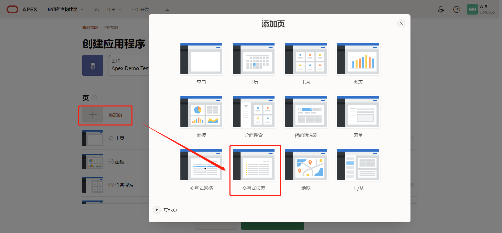
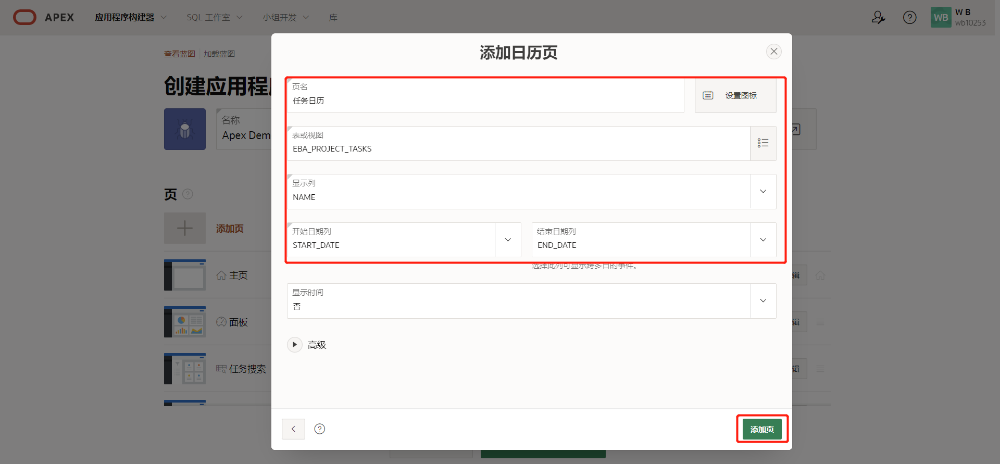
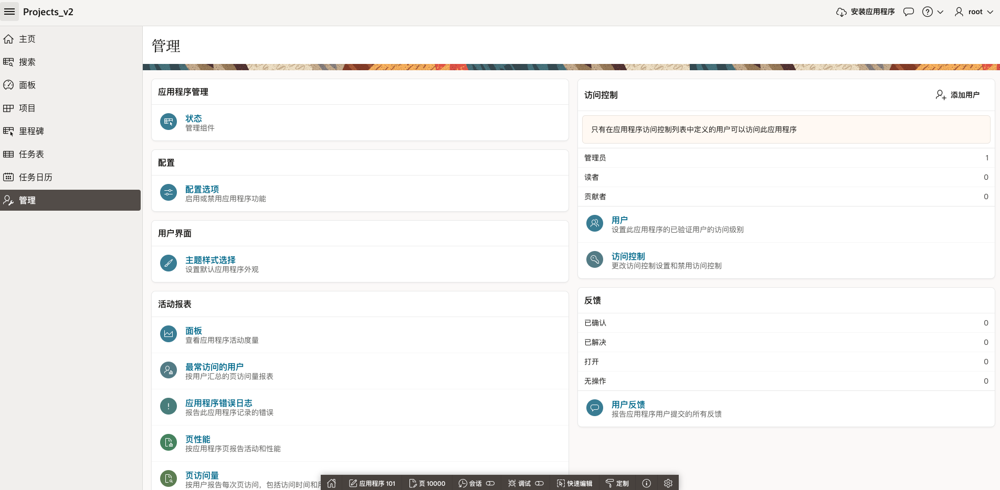
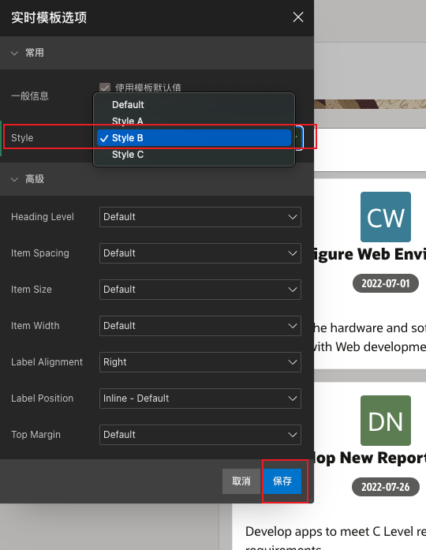
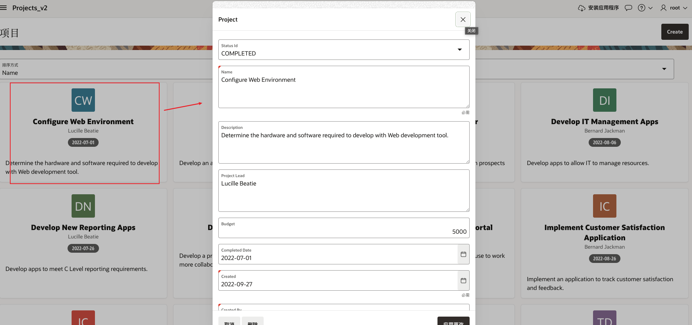
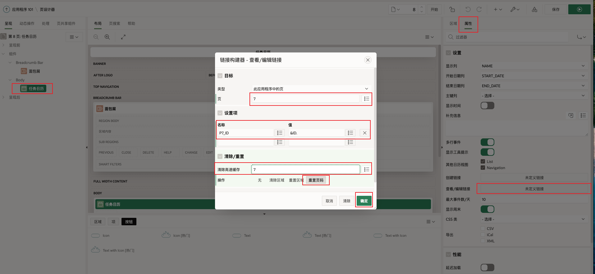

# APEX新建项目应用训练

## Workshop 概述

本研讨会将引导您创建基于 Oracle 数据库中现有表的应用程序。在极短的时间内从零概念变成APEX

预计时间：70 分钟

### 目标

- 获得免费的开发环境
- 基于现有表构建应用程序的第一个片段
- 了解如何重新加载应用程序并重新生成
- 了解如何添加页面和链接页面
- 了解如何操作区域和项目
- 了解如何以声明方式定义客户端交互性

*注意：本实验假设您使用的是 Oracle APEX 22.*

### 日程

| #    | 实验室                                                      | 时间    |
| ---- | ----------------------------------------------------------- | ------- |
| 1    | [安装样品表](#Lab 1 - 构建表和视图-安装示例表)              | 5分钟   |
| 2    | [创建应用程序](#Lab 2 - 构建应用程序: 使用创建应用程序向导) | 20 分钟 |
| 3    | [重新生成应用程序](#Lab 3 - 重新生成应用程序)               | 5分钟   |
| 4    | [改进仪表板](#Lab 4 - 增强仪表盘)                           | 5分钟   |
| 5    | [改善项目](#Lab 5 - 改善项目)                               | 15 分钟 |
| 6    | [改善里程碑](#Lab 6 - 改善里程碑)                           | 5分钟   |
| 7    | [改进任务](#Lab 7 - 改进任务)                               | 15 分钟 |

## Lab 1 - 构建表和视图-安装示例表

简介

在本实验室中，您将学习如何从样本数据集中安装样本表和视图，其中包含完整的样本数据。

******

### 任务 1：创建项目表

示例数据集是什么？

答：是Apex提供的测试数据。

1.从您的 APEX 工作区主页中，选择 SQL工作室，单击实用程序

然后单击示例数据集。

2.选择项目数据，单击安装。

3.点击下一步。

4.单击安装数据集。

 

5.单击退出。

*****

### 任务 2：查看数据库对象

1.在 App Builder 菜单中，单击 SQL工作室。

2.单击对象浏览器。

3.单击以 EBA_PROJECT 开头的表，就能看到各种选项卡，例如数据、索引、约束等，从而查看表详细信息。

### 总结

动手实验1已经完成。此时,您已经知道如何在Apex中安装示例数据集。 请继续完成动手实验2的步骤。

*****

*****

## Lab 2 - 构建应用程序: 使用创建应用程序向导

简介
在本实验中，您将学习如何根据 Oracle 数据库中的现有表创建初始应用程序。 在实践中，您通常只会从一两个页面开始，然后使用创建页面向导将其他页面添加到您的应用程序中。

*****

### 任务 1：创建应用程序

1.在 App Builder 菜单中，单击应用程序构建器。

2.单击创建。

3.单击新建应用程序。

*****

### 任务 2：命名应用程序

1.在 Create Application 向导中，输入Apex项目名称后，单击外观中的设置按钮。

2.在外观对话框中，Apex默认提供了三种类型的主题和导航，我们可以自由选择。选择完成后，单击保存更改。

3.单击设置Apex应用程序显示图标。

4.在选择应用程序图标对话框中，可以上传自己的图标(如：公司Logo)，也可以使用Apex默认的图标。选择完成后，单击保存图标。

*****

### 任务 3：添加面板(Dashboard)页面

仪表板页面是使用各种图表显示重要信息的。 当您在动手实验1中创建示例数据集时，它还创建了一个视图 EBA_PROJECTS_V，用于连接来自不同表的数据。 此视图(VIEW)非常适合作为仪表板图表的基础。

1.在创建应用程序向导中单击添加页面。弹出添加页对话框后单击面板(Dashboard)。

2.单击图表 1，输入以下内容：

图表类型 - 选择条形图
图表名称 - 输入预算与成本
表或视图 - 选择 EBA_PROJECTS_V
标签列 - 选择NAME
值列 - 选择 BUDGET_V_COST

3.单击图表 2，然后输入以下内容：

图表类型 - 选择饼图
图表名称 - 输入项目状态
表或视图 - 选择 EBA_PROJECTS_V
标签列 - 选择STATUS
类型 - 选择计数

4.单击图表 3，然后输入以下内容，单击添加页。

图表类型 - 选择条形图
图表名称 - 输入项目负责人
表或视图 - 选择 EBA_PROJECTS_V
标签列 - 选择 PROJECT_LEAD
类型 - 选择计数

备注：您也可以添加第四个图表，本课程为了演示，就不再继续添加。

*****

### 任务 4：添加项目页面

当您只想显示一些详细信息时，卡片页面功能非常的不错。如EBA_PROJECTS 表只有 12 条记录，可以很好地用作卡片页面。

1.在创建应用程序向导中单击添加页面。弹出添加页对话框后单击卡片。

在添加卡页面上，输入以下内容后，单击添加页。

页面名称 - 输入项目
表或视图 - 选择 EBA_PROJECTS
标题栏 - 选择NAME
正文列 - 选择DESCRIPTION
图标缩写列 - 选择NAME
徽章栏 - 选择 COMPLETED_DATE

*****

### 任务 5：添加里程碑页面

EBA_MILESTONES 中有 30 条记录。 因此，您将添加一个报告页面和一个关联的表单页面。

1.在创建应用程序向导中，单击添加页面。

单击交互式报告。

2.在添加报告页面上，输入以下内容后，点击添加页。

页面名称 - 输入里程碑
表或视图 - 选择 EBA_PROJECT_MILESTONES
勾选包括表格
展开查找列：

查找键 1 - 选择 PROJECT_ID
显示列 1 - 选择 EBA_PROJECTS.NAME

*****

### 任务 6：添加任务页面

EBA_PROJECT_TASKS 表是主表，其中记录将被审查和更新的次数最多。 因此，您将为此表添加分面搜索、报表和表单页面以及日历页面。

1.在创建应用程序向导中，单击添加页面。

单击分面搜索。

2.在添加分面搜索页面上，输入以下内容，然后单击添加页面。

页面名称 - 输入任务搜索
表 - 选择 EBA_PROJECT_TASKS

3.创建好的画面是可以拖动的，如：需将任务搜索页面放在仪表板页面下方。

对于任务搜索画面，其创建后它默认排列在最后。因此您可以单击并按住四个平行条进行拖动，直到它显示在 Dashboard 页面和 Projects 页面之间，然后松开鼠标。

4.现在添加报告和表单页面。
在创建应用程序向导中，单击添加页面。

单击交互式报告。

5.在添加报告页面上，输入以下内容后，单击添加页

页面名称 - 输入任务报告
表或视图 - 选择 EBA_PROJECT_TASKS
勾选包括表格
展开查找列

查找键 1 - 选择 PROJECT_ID
显示列 1 - 选择 EBA_PROJECTS.NAME
查找键 2 - 选择 MILESTONE_ID
显示列 2 - 选择 EBA_PROJECT_MILESTONES.NAME

6.最后我们将添加一个日历。
在创建应用程序向导中，单击添加页面

单击日历。

7.在添加日历页面上，输入以下内容后，单击添加页面。

页面名称 - 输入任务日历
表或视图 - 选择 EBA_PROJECT_TASKS
显示列 - 选择NAME
开始日期列 - 选择 START_DATE
结束日期列 - 选择 END_DATE
点击添加页面

备注：如果您转到 SQL工作室 > 数据库对象，选择 EBA_PROJECT_TASKS 表，然后单击创建应用，它将创建一个具有Dashboard页面、分面搜索页面、报表和表单页面以及日历页面的应用程序（如果适用） 全部基于选定的表。 这种技术为创建应用程序提供了一个很好的起点，尤其是在您不确定要预先设置哪些页面的情况下。

*****

### 任务 7：生成应用程序

1.现在您已经添加了所有页面，这个时候就可以创建应用程序并查看它。

滚动到页面底部，然后单击创建应用程序。

2.生成应用程序后，您的新应用程序将显示在应用程序主页中。

单击运行应用程序。

*****

### 任务 8：运行时应用程序

1.输入您的用户名密码。 单击登录。

2.登录成功后如下所示。

①主页

②面板画面

③任务搜索画面

④项目画面

⑤里程碑画面

⑥任务报告画面

⑦任务日历画面

*****

### 总结

这样就完成了实验 2部分。此时您已经知道如何基于现有的数据库对象，创建具有多种不同页面类型的应用程序。

创建任务3-6的画面时，除了在创建应用程序时添加画面，也可以在应用程序创建完成后再去添加。

请继续完成动手实验3的步骤。

*****

## Lab 3 - 重新生成应用程序

### 介绍

在运行环境中，如果您导航到里程碑，然后从报告页面中单击编辑图标，将显示用于维护里程碑的表单页面。您会注意到只有几个字段。因此，最好使用类似于电子表格的交互式网格，其中可以直接在网格中维护多个记录。

 

*注意：查看如何从上一个实验室转到您的运行时环境。*

### 任务 1：删除生成的应用程序

鉴于您要从“创建应用程序向导”重新生成应用程序，最好删除刚刚生成的应用程序以避免混淆。

1. 在运行环境中，在开发工具栏中，单击**Application xxxxx**。

    

   

​    

   *注意：开发人员工具栏仅向从 App Builder 运行应用程序的开发人员显示。最终用户将永远不会看到开发者工具栏*

2. 在应用程序主页的任务下，单击**删除此应用程序**。

   

   

    

3. 在确认删除页面上，单击**立即永久删除**。

### 任务 2：重新加载项目应用程序

创建应用程序向导包括重新加载您之前生成的应用程序的功能，从而可以轻松进行一些更改并生成初始应用程序的新改进版本。

1. 在 App Builder 主页中，单击**Create**。

   

   

    

2. 单击**新建应用程序**。

3. 单击**加载蓝图**。 在加载蓝图上，对于生成的最新应用程序，单击**加载**。

    

   

    

   将显示先前定义的应用程序蓝图或叫做模版。

### 任务 3：替换里程碑页面

您将删除原始报告和表单页面，然后添加一个新页面，并将其重新定位在页面列表中，而不是使用两种方法来维护里程碑记录。

1. 在页面列表中，对于里程碑，单击**编辑**。

2. 单击**删除**。

    

   

​    

3. 在创建应用程序向导中，单击**添加页面**。

4. 单击**交互式网格**。

5. 在添加交互式网格页面上，输入以下内容：

   - 页面名称 - 输入**里程碑**
   - 表或视图 - 选择**EBA_PROJECT_MILESTONES**
   - 点击**添加页面**

    

   

    

6. 现在重新排序新页面。

   在页面列表中，对于里程碑页面，选择汉堡包。 将页面向上拖动，直到它位于“项目”页面下方并放下。

    

   

    

### 任务 4：添加状态页面

EBA_PROJECT_STATUS表用于维护项目状态**。**这个表应该是可维护的；但是，只有应用程序管理员才能修改记录。因此，在管理下添加状态页面是最佳解决方案。

1. 在创建应用程序向导中，单击**添加页面**。

2. 单击**交互式网格**。

3. 在添加交互式网格页面上，输入以下内容：

   - 页面名称 - 输入**状态**
   - 表或视图 - 选择**EBA_PROJECT_STATUS**
   - 展开**高级**
     - 单击**设置为管理页面**
   - 点击**添加页面**

    

   

    

### 任务 5：完成应用程序

创建应用程序向导还能够为您的应用程序添加各种功能，例如访问控制、活动报告、反馈等，以使您的应用程序在功能上更加完整和“生产就绪”。

1. 在 Create Application Wizard 中，对于 Features，单击**Check All**

2. 单击**创建应用程序**

    

   

   注意：您的新应用程序通常会有一个新的应用程序 ID

    

   您的新应用程序将显示在 App Builder 中。

3. 单击**运行应用程序**。

4. 输入您的用户凭据。

5. 导航到**里程碑**。

6. 双击任何列以查看如何将数据直接输入到网格中。

    

    

   *注意：项目列将显示项目列表，名称和描述列将是文本区域，到期日期列将是日期选择器，根据不同的数据类型。*

7. 单击页面左上角的导航按钮，然后导航到**管理**以查看提供的功能。

    

   

 

## Lab 4 - 增强仪表盘

### 任务 1：删除图表 4

查看仪表板，您会看到图表 4 是基于演示数据的，应该删除。

1. 在运行时环境中，单击**Dashboard**。

2. 在 Developer Toolbar（在运行时页面底部）中，单击**Edit Page 3**。

   

   

    

   您现在应该在*Page Designer*中。Page Designer 是您将大部分时间用于改进应用程序的地方。Page Designer 中有三个窗格。左窗格最初显示渲染树，其中包含页面组件列表。中间窗格显示布局、页面表示和画廊（在底部），您可以从中将新组件拖放到布局中。右侧窗格是属性编辑器，您可以在其中更改所选组件的属性。

   *注意：如果您在页面底部没有看到开发者工具栏，请尝试关闭当前运行时环境并从 App Builder 重新访问它。*

3. 在 Page Designer 的渲染树（左窗格）中，向下滚动并*右键单击***Chart 4**并选择**Delete**。 

   

   

    

4. 让我们再次查看仪表板。 在页面设计器工具栏（位于屏幕顶部）中，单击**保存并运行页面**按钮。

    

   

    

   将显示修改后的布局。

    

   

    

### 任务 2：移动区域

查看修改后的仪表板页面，将预算与成本图表单独放在一条线上看起来会更好。

1. 在运行时环境中，通过单击Developer Toolbar 中的**Edit Page 3**或手动导航回 App Builder 浏览器选项卡，导航回 App Builder。

2. 在 Page Designer 的渲染树（左窗格）中，单击**Project Status**。 在属性编辑器（右窗格）中，***检查\*** **Layout > Start New Row**。*注意：在布局（中间窗格）中，项目状态区域将自行移动到一行* 

    

   

    

3. 现在将 Project Leads 图表向上移动到与 Project Status 图表相同的行。 在渲染树（左窗格）中，单击**Project Leads**。 在属性编辑器（右窗格）中，***取消选中\*** **Layout > Start New Row**。*注意：在 Layout（中间窗格）中，Project Leads 区域将向上移动到与 Project Status 位于同一行* 

    

   

    

4. 现在来查看页面！ 单击**保存并运行页面**按钮。

    

   

    

## Lab 5 - 改善项目

### 介绍

在本实验中，您将学习如何使用*创建页面*向导向您的应用添加其他页面。然后，您将新页面链接到现有的卡片页面。然后，您将学习如何轻松操作项目的显示方式，并最终创建一个*动态操作*。

### 任务 1：更改卡片区域样式

查看 Projects Card 区域，您应该注意到卡片的图标是圆形的，可以以不同的方式显示。要更改卡片区域样式，您将直接在运行时环境中使用**实时模板选项。**您也可以从 App Builder 进行更改；但是，进行更改要容易得多，因为您可以看到结果。

1. 在运行时环境中，单击**Projects**。

   

2. 在 Developer Toolbar（在运行时环境的底部）中，单击**快速编辑**。

   移动鼠标直到它在卡片区域内，并且该区域周围有一个蓝色框，右上角有一个扳手。 点击扳手。

    

   

   

   

    

3. 在“实时模板选项”对话框中，选择以下选项：

   - 样式 - 选择**样式 A**

4. 点击**保存**

    

   

    

### 任务 2：增强项目页面

您会注意到“项目”页面根据当前可用宽度显示卡片列。让我们将网格列数固定为 4。我们还将在卡片的副标题中添加项目负责人。

1. 在 Developer Toolbar（运行时环境的底部）中，单击 *编辑页面 4*

   

   

2. 在 Property Editor（右窗格）中，在 Attributes 选项卡下，更改以下内容：

   - 网格列到**4 列**

   - **PROJECT_LEAD**的副标题栏

   - 点击 *保存并运行页面* 按钮

     

3. Cards 区域现在每行仅显示四个项目。项目负责人添加在卡片的副标题中。

   

### 任务 3：添加表单页面

目前没有办法维护项目记录。因此，您将使用*创建页面向导在**EBA_PROJECTS*表上创建一个表单页面。

1. 通过单击开发人员工具栏中的**应用程序 xxxxx**或手动导航回 App Builder 浏览器选项卡，导航回 App Builder。

2. 在应用程序主页上，单击**Create Page**。

    

   

    

3. 在“创建页面”对话框中，单击**“表单”**。

    

   

     

   

    

4. 在 Create Form 对话框中，对于 Page Attributes，输入以下内容：

   - 页面名称 - 进入**项目**
   - 页面模式 - 单击**模式对话框**
   - 选择表**EBA_RPOJECTS**

   

    

5. 对于导航菜单，选择**标识此页面的现有导航菜单条目**。对于现有导航菜单条目，选择**项目**。 单击**下一步**。

    

   

    

   

    

6. 对于主键列，选择**ID (Number)**。 单击**创建**。

    

   

   注意：如果您正确遵循了前面的部分，这将创建*第 10 页：项目。*如果不是第 10 页，请重复实验 3，并确保创建里程碑和状态的交互式网格

​    

### 任务 4：链接到项目页面

现在将此新页面链接到项目卡页面。 *注意：为卡片区域定义链接需要修改 SQL 语句。但是，在 Oracle APEX 的其他地方，定义链接非常简单且声明式的，您将在实验 7 中学习。*

1. 可以主页面搜索或者在应用程序工具栏中，单击页码 (10) 前面的页面选择器。 单击**4**，进入项目页面

    

   

    

   *注意：或者，您可以输入页码或使用应用程序工具栏中的向上/向下箭头导航到 Page Designer 中的不同页面*

2. 在渲染树（左窗格）中，右键单击**Projects**下的**Actions** ，然后单击**Create Action**。

    

   

    

   在属性编辑器（右窗格）中，更新以下属性：

   - **类型：** - 选择全卡
   - 单击**链接 > 目标**
   - 在链接生成器中，**页面**- 输入**10**
   - 在**Set Items**下，输入**P11_ID**作为**Name**并输入**&ID。**为**价值**

    

   

    

3. 您还需要能够添加新项目，因此需要添加一个按钮并将其链接到项目表单页面。添加它的最简单方法是将组件从图库中拖放到布局（中间窗格）中。

   - 在布局（中间窗格）中，单击**面包屑**以突出显示该区域。
   - 在画廊（布局下方）中，单击**按钮**。
   - 单击并按住**文本 [热]**。
   - 将按钮向上拖动到面包屑区域，然后将鼠标悬停在**创建**占位符下方。

   一旦 CREATE 选择扩展为一个大的黄色框，松开鼠标。

    

   

    

4. 现在更新按钮属性。 在属性编辑器（右窗格）中，输入以下内容：

   - 标识 > 按钮名称 - 输入**CREATE** *注意：一旦您输入按钮名称，标识 > 标签将更新为\*创建**

   - 行为 > 操作 -**在此应用程序中选择重定向到页面**

   - 行为 > 目标 - 单击

      

     未定义链接

     ，并输入：

     - 目标 > 页面 - 输入**11**
     - 清除 / 重置 > 清除缓存 - 输入**11**

5. 点击**确定**

    

   

    

6. 现在来测试页面链接是否有效！ 单击**保存并运行页面**按钮。单击项目卡或单击**创建**。

    

   

   

    

### 任务 5：更新项目的显示方式

可以轻松改进状态 ID、名称和项目主管的显示方式。**Status Id**项是**EBA_PROJECT_STATUS**表的外键。因此，您无需要求最终用户输入数字，而是将项目更新为基于查找表的值列表。Name 和 Project Lead 字段应更新为 Text Fields。最后，应该隐藏审计列（创建、创建者、更新者、更新者）。

1. 首先，您需要将状态项从数字条目更改为允许值列表。 在 Runtime 环境中，从 Project Form 页面的 Developer Toolbar 中，单击**Edit Page 11**。 或者，导航回 App Builder 浏览器选项卡，然后手动导航到第 11 页。

2. 在 Page Designer for Page 11的渲染树（左窗格）中，单击**P11_STATUS_ID**。 在属性编辑器（右窗格）中检查到从lookup table

    

   

   

    

3. 现在将 Name 和 Project Lead 项目更新为文本字段。 在渲染树（左窗格）中，单击**P11_NAME** 按住 [Control] 键（或 Mac 中的 [Command] 键）并单击**P11_PROJECT_LEAD**

   在 Property Editor（右窗格）中，对于 Identification > Type，选择**Text Field**

    

   

    

4. 最后一步是隐藏审计列。 在渲染树（左窗格）中，单击**P11_CREATED** 按住 [Shift] 键并单击**P11_UPDATED_BY**

   在 Property Editor（右窗格）中，对于 Identification > Type，选择**Hidden**

   

   

    

### 任务 6：改进完成日期

目前，可以在任何项目上输入完成日期。*但是，仅当状态为COMPLETED*时才允许输入完成日期将大大提高数据质量。实现此类功能需要 JavaScript 根据 Status 的值动态启用/禁用 Completed Date 项。幸运的是，作为 APEX 开发人员，您不需要编写这样的 JavaScript。您可以简单地定义一个*Dynamic Action*，它允许您通过指定触发器、操作和受影响的元素以声明方式定义此类客户端交互性。

1. 您需要在触发元素上定义动态操作，即状态。 在渲染树（左窗格）中，*右键单击***P11_STATUS_ID**。选择**创建动态操作**。 

    

   

​    

2. 更新动态操作，使其仅在状态为*COMPLETED*时触发。 选择动态操作（单击动态操作下的**新建**），在属性编辑器（右窗格）中，输入以下内容：

   - 标识 > 名称 - 输入**启用完成日期**
   - Client-side Condition > Type - 选择**Item = Value** *注：Client-side Condition > Item 自动设置为当前项目* P11_STATUS_ID**
   - 客户端条件 > 值 - 输入**3** *注意：值\* 3*对应的状态为 COMPLETED*

    

   

    

3. 接下来，您需要指定触发事件为真时会发生什么。 在渲染树（左窗格）中，单击 True（当前为 Show）下的操作。 在属性编辑器（右窗格）中，输入以下内容：

   - 标识 > 操作 - 选择**启用**（在**Component**下）
   - 受影响的元素 > 项目 - 选择**P11_COMPLETED_DATE**

    

   

    

4. 最后，当触发事件为 false 时，*禁用*Completed Date 项非常重要。在渲染树（左窗格）的动态操作下，*右键单击***启用**。选择**创建相反的动作**。 

   

    

5. 与其在页面下方显示“完成日期”，不如直接在“状态”项目之后显示该项目。 在渲染树（左窗格）中，单击**P11_COMPLETED_DATE**。 在属性编辑器（右窗格）中，输入以下内容：

   - 布局 > 序列 - 输入**50** *注意：这会将 P11_COMPLETED_DATE 定位在 P11_STATUS_ID（序列 40）和 P11_NAME（序列 60）之间*
   - 布局 > 开始新行 -*取消选中* *注意：这会将项目放置在与前一个项目 P11_STATUS_ID 相同的行上

   

   

6. 更改P11_PROJECT_LEAD改成文本字段

   

7. 同时可以设置budget 项关闭新行动作，使横行变成了三等分

   

   

8. 现在查看项目表单页面。 单击“**保存** *” 注意：如果单击“保存并运行页面”按钮，您的更改将被保存，但页面不会运行。鉴于项目表单页面是一个模式页面，它必须从调用页面运行，而不是直接从页面设计器运行*

9. 导航回运行时环境，刷新浏览器，然后在导航菜单（左侧）中单击**项目**。 点击卡片记录，在表单页面显示对应的记录。 更改状态并确保正确启用/禁用完成日期。 进行更改并单击**应用更改**，或单击**取消**。

    

   

    

### 总结

这样就完成了实验 5。您现在知道如何向应用程序添加其他页面、将页面链接在一起、修改项目的显示方式以及以声明方式定义客户端交互性。

## Lab 6 - 改善里程碑

### 介绍

在本实验中，您将学习如何更新并保存*交互式网格*的布局以改进您的里程碑。

### 任务 1：更改名称列

在您的运行环境中，单击**Milestones**然后双击一条记录，您可以编辑详细信息。导航到每一列，注意 Project 列是一个选择列表，Name 和 Description 列是文本区域，Due Date 是一个日期选择器。一般来说，名字不会那么长；因此，您应该将列类型更新为文本字段。

1. 导航到应用程序生成器。

2. 在您的应用程序中，导航到 **第 5 页：Page Designer 中的里程碑**。

3. 在渲染树（左窗格）中，在**Project Milestones**区域下，展开**Columns**。 在列列表中单击**名称**。 在 Property Editor（右窗格）中，对于 Identification > Type，选择**Text Field**。

    

   

    

4. 在应用程序工具栏中，单击**保存并运行页面** 双击记录并查看名称列。

    

   

    

### 任务 2：更新网格布局

再次查看报告，将列重新排列为以下顺序将是有益的 - 名称、项目、到期日期，然后是描述。冻结名称列也很有用，这样用户可以左右滚动以查看更多描述列。

1. 在运行时环境中，单击**操作**，然后单击**列**

    

   

    

2. 在“列”对话框中，单击**“名称**”，然后单击向上箭头将列移到“**项目**”之前。 单击**保存**。

    

   

    

3. 您还可以使用拖放对列重新排序。

   - 将鼠标悬停在**截止日期**列的开头，直到显示移动指示器。
   - 单击并按住鼠标。
   - 将该列向左拖动，直到它显示在“**描述”**列之前。
   - 释放鼠标，放下列。

   

   

    

4. 现在列的顺序正确，您应该冻结 Name 列。

   - 单击**名称**列标题。
   - 单击**冻结**。

    

   

    

5. 现在需要调整列大小以更好地显示数据。

   - 将鼠标悬停在**名称**和**项目**列之间，直到显示调整大小指示符。
   - 向右拖动列分隔符，直到它适合**Name**列的大小。
   - 对 Project 和 Due Date 列重复此操作。 *注意：您还可以使用列末尾的调整大小指示符来扩大说明列的大小*

    

   

   

   

    

6. 要测试冻结显示，请重新显示菜单。单击应用程序名称前面的图标。

    

   

    

### 任务 3：保存报告

您对网格布局所做的更改仅对您可见。如果其他用户登录，他们将看到具有先前列顺序和列大小的原始布局。因此，您需要保存默认报表布局。

1. 在运行时环境中，单击**Actions**，选择**Report**，然后选择**Save**。 *注意：只有从 App Builder 运行应用程序的开发人员才能保存“默认”报告。最终用户只能使用“另存为”*

    

   

    

### 总结

这样就完成了实验 6。您现在知道如何操作交互式网格并保存默认报告。

## Lab 7 - 改进任务

### 介绍

在本实验中，您将学习如何定义共享*值列表*并使用它来改进任务的分面搜索和交互式报告页面。您还将了解将日历链接到任务表单页面是多么容易。

### 任务 1：定义共享值列表

在运行时环境中，导航到**任务搜索**并查看页面。请注意，Is Complete 列仅显示“Y”或“N”。现在导航到**Tasks Report**，您会注意到同样的问题。显示“是”或“否”会好得多。这可以通过定义*值列表 (LOV)轻松实现*

您可以直接在页面上定义 LOV。但是，如果您需要在多个页面上使用相同的 LOV，就像您在此处所做的那样，最好将其定义为*Shared Component*一次。

1. 导航回 App Builder 浏览器选项卡，单击您的应用程序。

2. 在应用程序主页上，单击**共享组件**。

    

   

    

   或者，如果在 Page Designer 中，则在工具栏中单击**共享组件**图标。

    

   

    

3. 在共享组件上的**其他组件**下，单击**值列表**。

   

    

4. 您会注意到已经列出了几个 LOV。 要创建新的 LOV，请单击**创建**。

    

   

    

5. 在 Create List of Values 对话框中，对于 Source，保留默认选择（“从新开始”）。单击**下一步**

   

6. 在名称和类型对话框中，输入以下内容：

   - 名称 - 输入**YES_NO**
   - 类型 - 选择**静态**

7. 单击**下一步**

   

    

8. 在“静态值”对话框中，输入以下内容：

   - 序列 1
     - 显示值 - 输入**是**
     - 返回值 - 输入**Y**
   - 序列 2
     - 显示值 - 输入**否**
     - 返回值 - 输入**N**
   - 单击**创建值列表**

    

   

    

### 任务 2：更新分面搜索

现在您已经定义了共享组件，您需要在 Faceted Search 页面上使用它。

1. 在面包屑中，单击**应用程序 xxxxx**

    

   

    

2. 在应用程序主页中，单击**3 - 任务搜索**

    

   

    

3. 您首先要更新*Search*中的条目。

   - 在 Page Designer 的渲染树（左窗格）中的搜索下，单击**P3_IS_COMPLETE_YN**。

4. 在属性编辑器（右窗格）中，选择以下内容：

   - 值列表 > 类型 - 选择**共享组件**
   - 值列表 > 值列表 - 选择**YES_NO**

    

   

    

5. 接下来，您还想更新*Report*中显示的值。

   - 在渲染树（左窗格）中，在**Project Tasks**下，展开**Columns**。
   - 在列列表中，单击**IS_COMPLETE_YN**。

6. 在属性编辑器（右窗格）中，输入以下内容：

   - 标识 > 类型 - 选择**纯文本（基于值列表）**
   - 值列表 > 类型 - 选择**共享组件**
   - 值列表 > 值列表 - 选择**YES_NO**

    

   

    

7. 该报告有许多列。描述栏占用太多空间，所以应该隐藏。

   - 在渲染树（左窗格）的**Project Tasks**下的列列表中，单击**DESCRIPTION**。
   - 在 Property Editor（右窗格）中，对于 Identification > Type，选择**Hidden Column**。

    

   

    

8. 当我们在页面上时，我们可以快速更改搜索列的顺序。

   - 在渲染树（左窗格）中，在**Search**下，单击**P3_MILESTONE_ID**
   - 在 Property Editor（右窗格）中，对于 Layout > Sequence 输入**25** *注意：这会将 P3_MILESTONE_ID 定位在 P3_PROJECT_ID 之后（Sequence 20）*
   - 在渲染树（左窗格）中，单击**P3_IS_COMPLETE_YN**
   - 在 Property Editor（右窗格）中，对于 Layout > Sequence 输入**35** *注意：这会将 P3_IS_COMPLETE_YN 定位在 P3_ASSIGNEE 之后（Sequence 30）*

    

   

    

9. 让我们回顾一下 Faceted Search 是否完整。

   - 在页面设计器工具栏中，单击**保存并运行页面**。

    

   

    

### 任务 3：更新交互式报告

任务报告还需要更新 Is Complete 列。

1. 在运行时环境中，单击菜单中的**任务报告**。

   - 在 Developer Toolbar（页面底部）中，单击**Edit Page 6**。 *注意：您还可以在 App Builder 浏览器选项卡中导航回您的应用程序主页，然后手动导航到第 6 页*

2. 在 Page Designer 中，选择**Page 6: Tasks Report**，在渲染树（左窗格）中，在**Project Tasks**区域下，展开**Columns**。

   - 在列列表中，单击**IS_COMPLETE_YN**。

3. 在属性编辑器（右窗格）中，输入以下内容：

   - 标识 > 类型 - 选择**纯文本（基于值列表）**
   - 值列表 > 值列表 - 选择**YES_NO**

    

   

    

4. 运行应用程序。 在页面设计器工具栏中，单击**保存并运行页面**。

    

   

    

5. 单击记录的编辑图标。 请注意，Is Complete 使用了 Switch，因此无需修改 Form 页面。 *注意：表单页面是第 7 页，我们将在下一部分中需要它*

### 任务 4：链接日历

任务日历页面显示了许多任务；但是，没有办法直接修改记录。因此，您应该添加一个指向现有项目任务表单页面的链接。

1. 在运行时环境的导航菜单中，单击**任务日历**

2. 单击任何条目以确认它只是显示事件详细信息

    

   

    

3. 在 Developer Toolbar（页面底部）中，单击**Edit Page 8**

4. 在 Page Designer 的渲染树（左窗格）中，在**Tasks Calendar**区域下，单击**Attributes**。

   - 在属性编辑器（右窗格）中，对于设置 > 查看/编辑链接，单击**未定义链接**

5. 在“链接构建器”对话框中，输入以下内容：

   - 目标 > 页面 - 选择**7**
   - 设置项目 > 名称 - 选择**P7_ID**
   - 设置项目 > 值 - 选择**ID**（返回**&ID。**）
   - 清除 / 重置 > 清除缓存 - 输入**7**

6. 点击**确定**

    

   

    

7. 如果在从日历调用“项目任务表单”页面时更新了任务名称、开始日期或结束日期，则更新日历很重要。

   - 在渲染树（左窗格）中，*右键单击***任务日历**。 
   - 选择**创建动态操作**。

    

   

    

8. 选中Dynamic Actions 下的**New**后，在 Property Editor（右窗格）中输入以下内容：

   - 标识 > 名称 - 输入**refresh calendar**
   - 时间 > 事件 - 选择**对话框关闭**（在**Framework Events**下）

   *注意：当项目任务表单页面关闭时，刷新日历事件将触发，因为它是一个模式页面*

    

   

    

9. 在渲染树（左窗格）中，在 True 操作下，单击**Show**。 在属性编辑器（右窗格）中，选择以下内容：

   - 标识 > 操作 - 选择**刷新**（在**Component**下）
   - 受影响的元素 > 选择类型 - 选择**区域**
   - 受影响的元素 > 地区 - 选择**任务日历**

   点击**保存**

    

   

    

10. 导航回运行时环境，然后刷新浏览器。

    - 单击日历条目

     

    

     

    如果您更新名称、开始日期或结束日期，并单击项目任务表单页面上的**应用更改**，更改将立即反映在日历中。

### 总结

这样就完成了 Lab 7 和研讨会。您现在知道如何创建共享组件，使用它来改进分面搜索页面和交互式报表，以及链接更新记录后刷新的日历页面。

