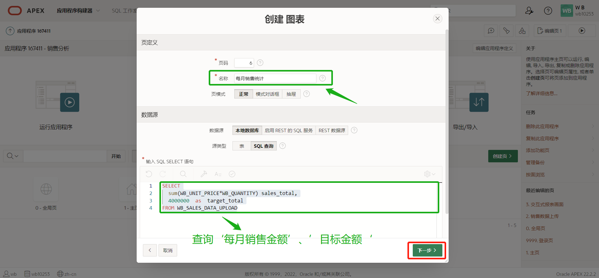

## APEX动手实验1(数据上传、IR+IG、图表)

### Workshop 概述

本次研讨会将带您使用Apex数据上传、数据分析等功能，从0开始逐步创建完成。

预计时间：3小时以内


### 目录

- Lab1 - 数据上传
- Lab2 - 销售数据分析(IR+IG)
- Lab3 - 销售数据分析(Chart)


备注:本次workshop的Lab1和Lab2是连着的，在Lab1上传销售数据，然后在Lab2中对Lab1上传的销售数据进行分析。另外，关于数据上传的文件，我们会提供给大家，用于本次的hands-on。

下记为数据文件的示例数据[销售数据_DataUpload.xlsx]。


****

****

### Lab 1 - 数据上传

简介

Apex数据上传....通过复制和粘贴 CSV 数据、选择示例数据集或上传文件，将数据加载到Oracle APEX 。本次hands-on使用Excel上传数据文件。

将数据加载到APEX时的主要功能包括：

- 复制并粘贴 CSV 数据，或选择样本数据集。
- 上传文件（支持 CSV、XLSX、TXT、XML 或 JSON 文件）。

****

#### 任务1：开发者数据上传

点击‘SQL工作室 ->实用程序-> 数据工作室’ - (New Table 或 Existing Table)。


在数据工作室中，点击’数据加载‘。


点击’选择文件‘，选择'销售分析.xlxs'文件。


在表名处设置目标表，填写新表名或选择现有表，配置完成后点击'数据加载'按钮。

※在此处...请大家在‘表名’处添加自己的前缀进行标识，如：XX_SALES_DATA_UPLOAD。


数据加载完成如下所示。


****

#### 任务2：最终用户数据上传

提供数据加载向导，最终用户可在界面上自行导入。

最终用户数据加载方法的有三种(附加、合并、替换)，设置该方法需数据模板创建完成后，在当前模板中设置。

附加(默认)  →      将行附加到表中。（insert）

合并：         →     将行合并到表中，必须为数据模板必须定义主键才能使用此选项。(insert/update)

替换：         →     加载新数据之前，将删除目标表或集合中的现有数据，然后再插入数据。(delete/insert)

##### ①创建应用程序

点击‘创建按钮’，创建Apex应用程序。


选择‘新建应用程序’。


点击'创建应用程序'。


##### ②定义数据加载模板

应用程序创建完成后，点击‘共享组件’。


在数据源中点击‘数据加载定义’。


点击‘创建’按钮，创建数据加载模板。


在创建数据加载画面，选择‘从头开始’，然后点击’下一步‘。


选择数据上传目标表，然后点击’下一步‘。选择Lab1-任务1中的表名。


选择数据加载模板Excel文件后，然后点击’下一步‘。


配置映射列(此处...可修改列的映射关系)，然后点击’创建并添加页‘。


##### ③创建数据上传页

在②中点击’创建并添加页‘按钮后，会跳转到’文件上传‘向导页，然后点击‘创建页’。


页面创建成功后，如下所示，点击运行画面。


输入个人的Apex用户/密码，点击登录即可。


画面运行结果如下所示。


##### ④数据上传测试

事前查询XX_SALES_DATA_UPLOAD表中数据条数，或删除表中的数据。

※路径：'SQL工作室'->'SQL命令'。

```sql
SELECT COUNT(1) FROM wb_sales_data_upload;
```


数据件数确认后，返回销售数据上传画面，点击’选择文件‘按钮，上传数据文件。


数据文件选择后，点击’数据加载‘按钮把数据上传到Apex中。


如下所示，数据上传成功。


接下来...返回‘SQL工作室'->'SQL命令'中，使用SQL....查询XX_SALES_DATA_UPLOAD表中的数据件数。


如之前所说，Apex中最终用户数据上传方法的有三种(附加、合并、替换)，上记演示的为附加，数据文件Excel中存在20条数据，上传成功后...在DB中可发现这20条数据，如再次点击上传Excel数据文件，那么报表则会增加到40条数据。剩余的合并、替换大家可以尝试一下。


***

#### 概况

这样就完成了Lab1，您现在知道如何在Apex中上传数据。


***

***

### Lab 2 - 销售数据分析(IR+IG)

简介

在Apex中存在IR(交互式报表)、IG(交互式网格)和chart都可以对数据进行分析。

如：

IR、IG   →  筛选、过滤、高亮、Chart、分段控制。

Chart    →  条形图、面积图、折线图、饼图........等等等。

接下来我们一起动手，看一下Apex的图表数据分析能力。

****


#### 任务1：交互式报表(IR)

 ※交互式报表数据分析

##### ①创建交互式报表画面


选择‘交互式报表’，然后点击’下一步‘。


画面名称输入后，数据源选择Lab1-任务1中对应的表名。


画面创建成功后，如下所示，点击’运行‘。


##### ②交互式报表演示

**•Column 列**

Column 列...可以隐藏报表列，或者修改报表列的显示顺序。


**•Filter 过滤器**

Filter 过滤器...可按照一定的过滤条件过滤数据。


**•Compute 数据 -> 计算**

 计算...使用计算功能，可以添加新的计算列。


**•格式 -> 控制分段**

控制分段...可把同一类数据归类在一起显示。


**•格式 -> 突出显示**


**•Chart 图表**


**•交叉报表**

交叉报表...是行、列方向都有分组的报表。


•Primary/Private/Public report 默认主报表/专用/公共报表

保存私有报表

保存默认报表

保存公共报表

※保存公共报表前提条件 => 在编辑页中找到报表，点击属性，然后在属性中开启‘报表保存公共报表’功能。开启后即可保存公共报表。


**•Download 下载**

下载...可把报表当前显示内容下载到本地。


**•订阅**

订阅...开启订阅功能后，可按照所设置的频率（每天/每周/每月）把报表信息发送到您的邮箱。


****

#### 任务2：交互式网格(IG)

 ※交互式网格的数据分析和交互式报表的数据分析一致，详细请参照任务1。

##### ①创建交互式网格画面

备注：详细参照Lab2 -> 任务1 -> ①，在创建画面向导时，选择交互式网格即可。

##### ②交互式网格演示

备注：详细参照Lab2 -> 任务1 -> ②。


####  任务3：IG、IR增删改查

##### ①交互式网格(IG)支持CRUD。


##### ②交互式报表(IR)不支持CUD。


注意：为IR报表添加Form表单后，就可以开启CUD功能。


***

#### 概况

这样就完成了Lab2，您现在知道如何在Apex中使用报表的数据分析。


****

### Lab 3 - 销售数据分析(Chart)

(Lab 3 - 任务1~2)效果图如下所示：


#### 任务1：chart图表(※向导创建)

##### ①每月銷售統計(达标率)

在应用程序页中点击‘创建页’。

##### 

在创建页的向导中选择图表，然后点击’下一步‘。


选择‘状态测量仪数据计量表’，点击‘下一步’。


输入任意画面名称后，数据源选择‘SQL查询’。

```plsql
SELECT
  sum(WB_UNIT_PRICE*WB_QUANTITY) sales_total,
  4000000  as  target_total
FROM WB_SALES_DATA_UPLOAD;
```




画面创建完成后，如下所示。点击‘运行’。


画面显示效果如下。


#### 任务2：chart图表(※非向导创建)

##### ①前十大销售

右键点击Body区域，选择’创建区域‘。


把区域名称修改为’前十大销售‘，类型选择’图表‘。


点击区域属性，修改图表类型为’折线图‘。


点击系列，在系列属性中找到源，把’表/试图‘修改为’SQL查询‘。


把下记SQL文放入图表的‘代码编辑器-SQL查询’画面中。放入完成后，点击’确认‘。

```sql
-- 获取前10总销售额。
SELECT * 
FROM( 
    SELECT WB_BUSINESS_ID, 
           sum(WB_UNIT_PRICE*WB_QUANTITY)
    FROM WB_SALES_DATA_UPLOAD
    group by WB_BUSINESS_ID
    order by sum(WB_UNIT_PRICE*WB_QUANTITY) DESC
    )
WHERE ROWNUM <= 10
```


标签设置为业务员ID，值设置为总销售额，设置完成后，点击’运行‘。


画面显示效果如下。


##### ②地区销售

右键点击Body区域，选择’创建区域‘。


把区域名称修改为’地区销售‘，类型选择’图表‘。


点击区域属性，修改图表类型为’饼图‘。


点击系列，在系列属性中找到源，把’表/试图‘修改为’SQL查询‘。


把下记‘SQL文’放入图表的‘代码编辑器-SQL查询’画面中。放入完成后，点击’确认‘。

```sql
-- 获取地区的销售额
SELECT WB_AREA, 
       SUM(WB_UNIT_PRICE * WB_QUANTITY) 
FROM   WB_SALES_DATA_UPLOAD
GROUP BY WB_AREA
ORDER BY WB_AREA;
```


标签设置为厂区，值设置为总销售额，标签显示效果设置为‘标签-百分比’，设置完成后，点击’运行‘。


画面显示效果如下。


##### ③(同产品·不同厂区)销售比较(前10)

右键点击Body区域，选择’创建区域‘。


把区域名称修改为’(同产品·不同厂区)销售比较(前10)‘，类型选择’图表‘。


点击系列，在系列属性中找到源，把’表/试图‘修改为’SQL查询‘。


把下记SQL文放入图表的‘代码编辑器-SQL查询’画面中。放入完成后，点击’确认‘。

```sql
-- 获取同产品不同厂区的总销售额
SELECT * 
FROM (
    SELECT WB_SITE, 
       WB_PRODUCT_CLASS,
       SUM(WB_UNIT_PRICE * WB_QUANTITY) 
    FROM   WB_SALES_DATA_UPLOAD
    GROUP BY WB_SITE,WB_PRODUCT_CLASS
    ORDER BY SUM(WB_UNIT_PRICE * WB_QUANTITY) DESC
)
WHERE ROWNUM <= 10;
```


系列名设置为产品分类，标签设置为厂区，值设置为总销售额。


选择区域，点击属性，在属性中打开图列显示。设置完成后，点击’运行‘。


画面显示效果如下。


温馨提示：上记的Chart图表都是按照顺序从上到下依次排列。如果想要修改Chart图表的排列顺序，只需选中图表区域，在区域中找到是否’开启新行‘，通过该属性...就可以做到让多个图表在一行排列。


****

#### 概况

这样就完成了Lab3，您现在知道如何在Apex中构建图表。
